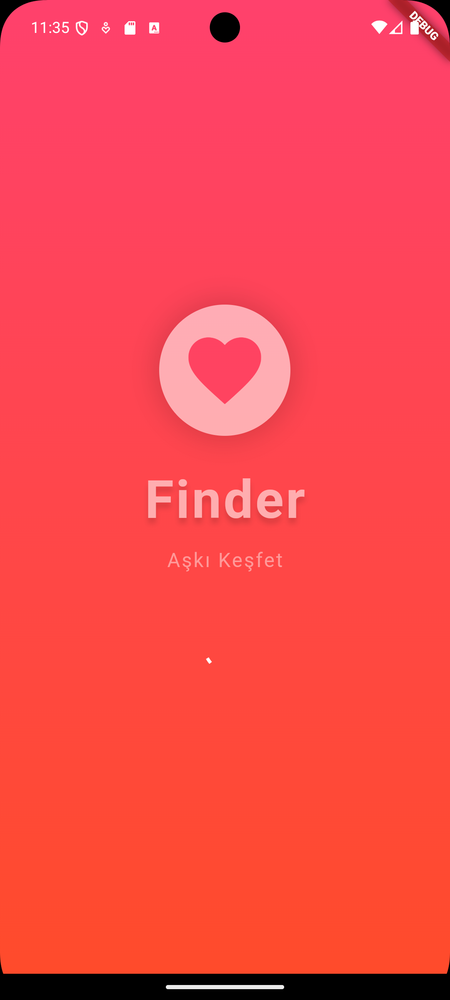
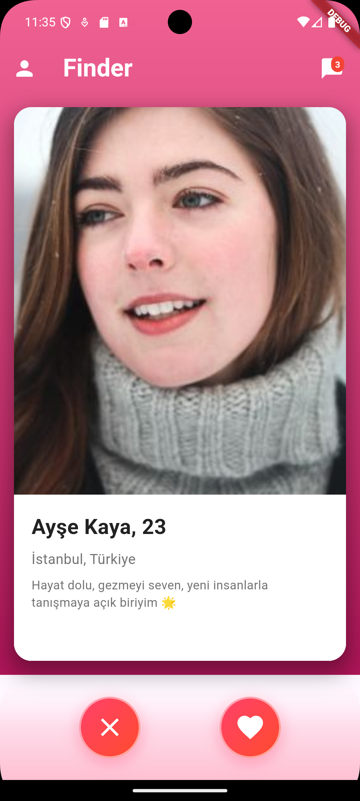
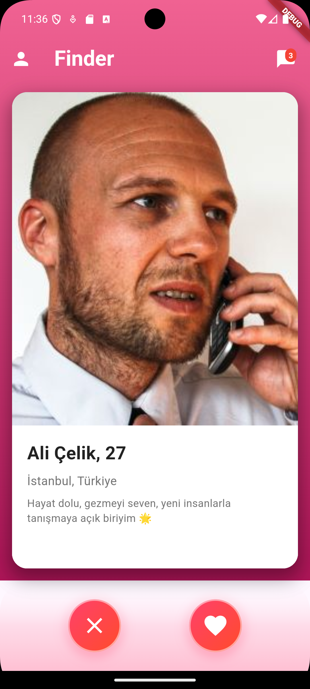
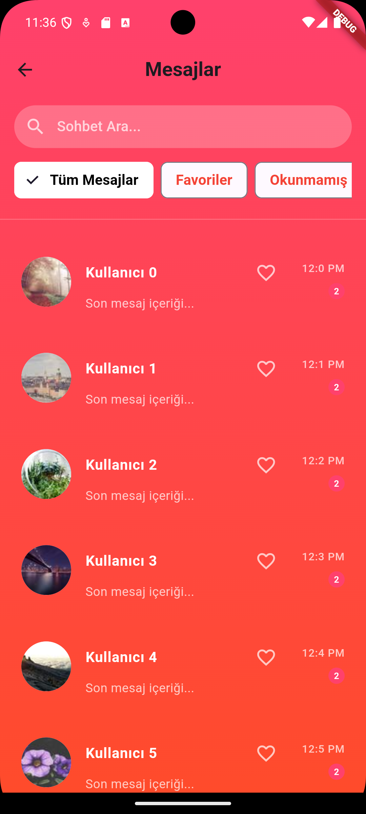
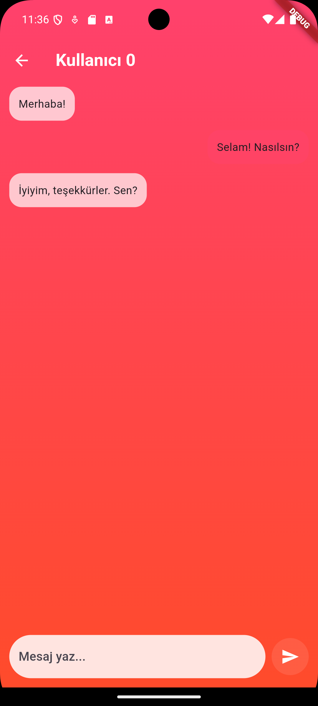
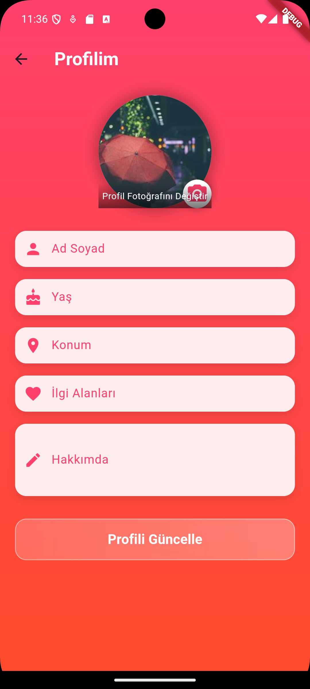

# Finder App 💕

Finder is a highly engaging, user-friendly 🖥️, and modern 🌟 interface designed for a dating app 💌. It provides a delightful way for users to add detailed profile information 👤, initiate meaningful conversations 💬, and connect with new and interesting people 🌍. Developed using the robust Flutter framework 🐦, it guarantees a smooth and visually appealing experience on mobile devices 📱. It is important to note that the app is currently a functional user interface prototype ⚙️ and does not yet include backend functionality or advanced features.

## Key Features 🌟

* **Profile Customization 👤**: Users can create a personal profile by adding or editing their name, age 🎂, location 📍, hobbies, interests ❤️, and personal descriptions ✍️ to express themselves better.
* **Messaging 💬**: Engage in one-on-one text-based conversations 📨 with potential matches or friends in a simple and intuitive chat interface.
* **Favorites ⭐ and Unread Messages 📩**: Easily switch between your favorite conversations and unread messages 📥 to stay organized and responsive.
* **Matching System 💖**: Browse profiles of other users, decide whether to like 👍 or skip ⏩, and enjoy a seamless experience while interacting with potential connections.

## Visual Overview 🖼️

Below are the screenshots 📸 of the app for better visualization:

<div style="display: flex; justify-content: space-between;">
    
    
    
</div>

<div style="display: flex; justify-content: space-between; margin-top: 20px;">
    
    
    
</div>

1. **Splash Screen 🌟**: A welcoming animation to introduce users to the app.
2. **Profile Editing Screen 📝**: Edit and update profile details with ease.
3. **Messages Screen 💌**: Manage all your conversations in a centralized hub.
4. **Chat Screen 💬**: Engage in live conversations with your matches.
5. **Matching Screen - Female Profile 👩**: Explore user profiles and initiate connections.
6. **Matching Screen - Male Profile 👨**: View profiles and express interest.

## How to Set Up 🛠️

Setting up Finder App is simple. Follow these steps 📝 to get started and run 🏃‍♂️ the project on your device:

1. **Clone the Repository 🔄**:

```
git clone <repo-url>
cd finder-app
```

2. **Install Dependencies 📦**: Ensure all required packages are installed:

```
flutter pub get
```

3. **Run the Application 🚀**: Start the app on your preferred simulator or device:

```
flutter run
```

## Tools and Technologies 🛠️

The following tools and technologies are used to build this project:

* **Flutter 🐦**: A UI toolkit for crafting beautiful, natively compiled applications.
* **Dart 💻**: The programming language used for Flutter projects, offering expressive and efficient code writing.
* **Provider 🌐**: A state management library that simplifies app development.
* **Shared Preferences 💾**: For storing user data locally, enhancing the user experience by remembering preferences.

## Important Notes 📝

Finder App is currently in its prototype stage 🚧. It serves as a foundation for a complete dating application, focusing primarily on the visual and interaction design aspects. Backend integration and additional features can be implemented to enhance its capabilities. Contributions to expand its functionality are warmly encouraged 🤝.

## How to Contribute 🤝

Contributions are essential to the growth and evolution of this project. To contribute, follow these steps:

1. **Fork the Repository 🍴**: Create a copy of the repository in your GitHub account.
2. **Create a New Branch 🌱**: Work on your feature or bug fix in a dedicated branch:

```
git checkout -b new-feature
```

3. **Commit Your Changes 📜**: Save your work with a meaningful commit message:

```
git commit -m "Added a new feature"
```

4. **Push Your Branch 🚀**: Upload your changes to GitHub:

```
git push origin new-feature
```

5. **Open a Pull Request 🔍**: Request to merge your changes into the main branch.

## License 📜

Finder App is open-source and freely available for use and distribution 💡. There are no restrictions, so feel free to explore, modify, and share this project.

**Developer 👨‍💻**: Şahan Hasret

With Finder App 💕, users are one step closer to meaningful connections 🌍. Your contributions can help this project reach its full potential!
